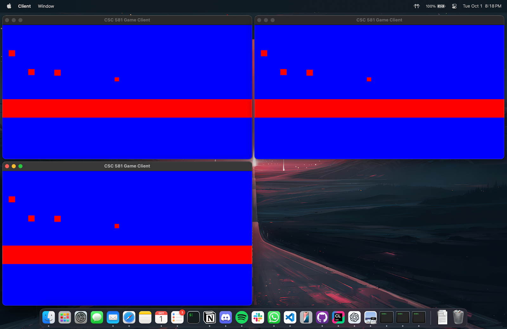
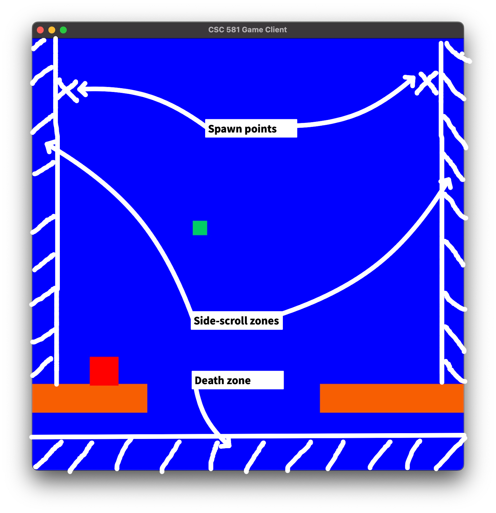
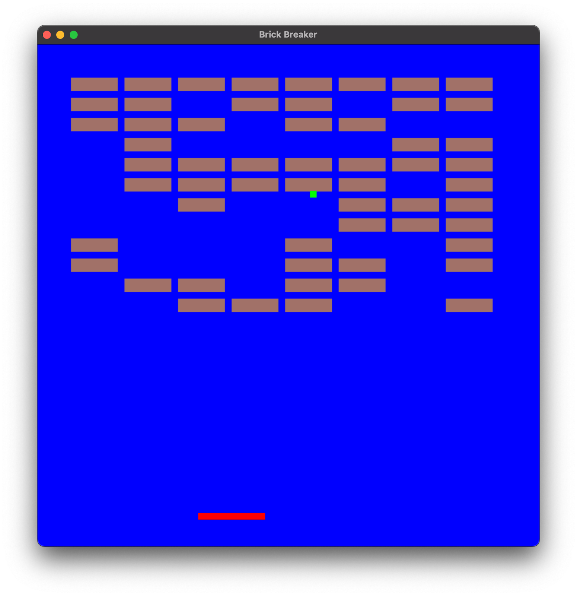

# GameEngine

- This is a game engine developed using SDL2 in C++ for the course CSC581 - Game Engine Foundations at NC State in the Fall of 2024.
- This repository is an import of the [original repository](https://github.ncsu.edu/yrajapa/GameEngine) from NCSU's GitHub Enterprise.

## Running the Game

  
Windows

## Requirements

1. Visual Studio Community 2022
2. SDL2 (included)
3. ZeroMQ and cppzmq (included)

## How to Run

### Group submission: Compile and run the game engine
1. Open the solution (`GameEngine.sln`) in Visual Studio Community 2022.
2. In the run configurations dropdown:
   - Select **'RunGameEngine'**.
3. Click the 'Local Windows Debugger' button to run the selected configuration within Visual Studio.

### Individual submission step 1: Compile servers, clients, and peers

1. Open the solution (`GameEngine.sln`) in Visual Studio Community 2022.
2. In the run configurations dropdown:
   - Select **'RunClientGame'**.
   - Right-click on the solution in solution explorer and click on 'Rebuid'.
   - Select **'RunPeerGame'**.
   - Right-click on the solution in solution explorer and click on 'Rebuid'.
   - Select **'RunPeerServer'**.
   - Right-click on the solution in solution explorer and click on 'Rebuid'.
   - Select **'RunServer'**.
   - Right-click on the solution in solution explorer and click on 'Rebuid'. 

### Individual submission step 2: Run servers, clients and peers

1. To run **'Server-Client'**:
   - Navigate to  `~/x64/RunServer` directory.
   - Double-click **Server.exe** to run the server.
   - Navigate to  `~/x64/RunClientGame` directory.
   - Double-click **ClientGame.exe** to run a client.
   - You can run multiple clients by double-clicking the .exe file again. 
2. To run **'Peer-to-Peer'**:
   - Navigate to `~/x64/RunPeerServer`.
   - Double-click the **PeerServer.exe** file to run the peer server.
   - Navigate to `~/x64/RunPeerGame`.
   - Double-click the **PeerGame.exe** file to run a peer.
   - You can run multiple clients by double-clicking the .exe file again.

**Note:**  
- Ensure that the `SDL2.dll` and `libzmq-v143-mt-gd-4_3_5.dll` files are present in the directories where the `.exe` files are located. These file are already included; do not remove it.
- Ensure that you run the servers before clients (or peers). 

  
MacOS (Silicon)

## Requirements
- Install SDL2: `brew install sdl2`
- Install CMake: `brew install cmake`
- Install other deps - `brew install cppzmq zeromq nlohmann-json`

## Building and running
- Note: Pre-built binaries can be found at `./build`
- To compile and run the game: `cmake -S . -B build && cmake --build build`
- The `build` directory will now contain the binaries
- Run the server executable first, then run 1 or more client executables

## Game Engine Features

- **Cross-platform**: The game engine is built using SDL2 and ZeroMQ and uses CMake for cross-platform compilation.
- **Physics Engine**: The game engine has a simple physics engine that supports collision detection and movement using 2-Dimensional acceleration and velocity vectors.
- **Networking**: The game engine supports both client-server and peer-to-peer networking models using ZeroMQ. JSON is used for serialization and deserialization of game entities and components.
- **Entity Component System**: The game engine uses an Entity Component System (ECS) for managing game entities and their components.
- **Event System**: The game engine is event-driven and supports event handling for various game events.
- **Input Handling**: The game engine supports keyboard input, including input chords (multi-key presses), for controlling entities and performing other actions in the game.
- **Rendering**: The game engine allows constant and proportional scaling of game objects and rendering game states with customizable frame rates. Additionally, individual clients can move the camera to focus on different parts of the game world.
- **Timeline**: The game engine supports a timeline for managing game events with controllable speed and the ability to pause, resume the game.
- **Multiplayer**: The game engine supports multiplayer gameplay with multiple clients (separate processes) interacting with the game world simultaneously.
- **Multi-threading**: The game engine uses multi-threading to handle networking and rendering in separate threads.
- **Replay System**: The game engine supports a replay system that records and replays a portion of the game client-side.
- **Side-scrolling**: The game engine supports side-scrolling gameplay with a camera that follows the player character.
- **Zones**: The game engine supports multiple spawn and death zones in the game world.

## Screenshots

- 
- 
- 
- 

## Common Keybindings

- `Arrow keys` - Movement of controllable entities.
- `esc` / `q` - Quit the game

## Attribution

We used following resources for development:

- SDL2 Documentation: [SDL Wiki](https://wiki.libsdl.org/SDL2/FrontPage)
- ZeroMQ Documentation: [ZeroMQ Wiki](http://wiki.zeromq.org/)
- SDL Game Development Tutorial Series: [YouTube Playlist](https://www.youtube.com/watch?v=FxCC9Ces1Yg&list=PLSPw4ASQYyymu3PfG9gxywSPghnSMiOAW&index=2)
- SDL2 with CMake: [StackOverflow Post](https://stackoverflow.com/questions/28395833/using-sdl2-with-cmake)
- Singleton Design Pattern: [StackOverflow Post](https://stackoverflow.com/questions/1008019/how-do-you-implement-the-singleton-design-pattern)
- Json Library: [nlohmann's JSON Library](https://github.com/nlohmann/json)
- Class templates (with explicit instantiation): [cppreference](https://en.cppreference.com/w/cpp/language/class_template)
- Type Erasure: [Blog Post](https://davekilian.com/cpp-type-erasure.html), [cplusplus Article](https://cplusplus.com/articles/oz18T05o/)
- Curiously Recurring Template Pattern (CRTP): [cppreference](https://en.cppreference.com/w/cpp/language/crtp)
